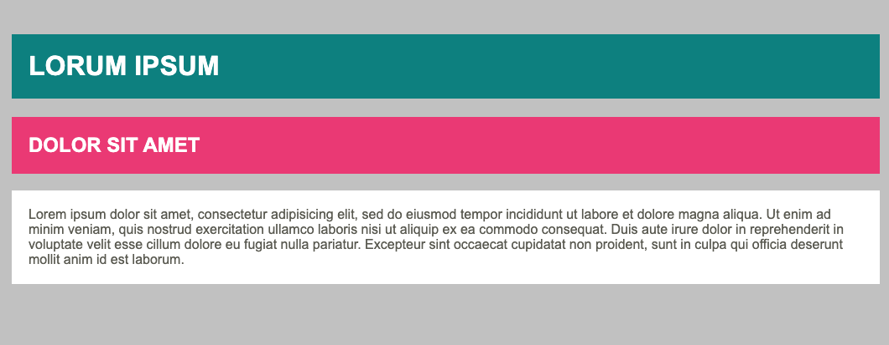

# background-padding

Kopieer je oplossing van 'background' uit labo 3 en werk deze verder uit met de volgende opdrachten:
- Maak een externe stylesheet aan en link deze aan je HTML-pagina.
- Pas de volgende styling toe:
    - Geef de body een margin van 20px rondom.
    - Geef de body vanboven 10px padding
    - Geef elke heading een padding van 20px
    - geef elke paragraaf een padding van 20px
## Verwacht resultaat

