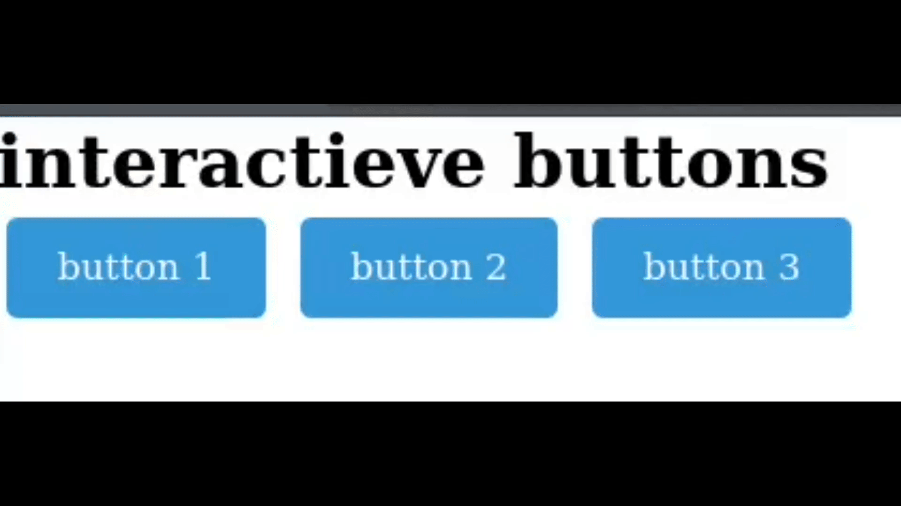

Je maakt een eenvoudige webpagina met een HTML-bestand en een apart CSS-bestand. Je past stijlen toe op drie knoppen zodat ze op verschillende manieren reageren op interactie.

**HTML Pagina aanmaken**

* Voeg de basisstructuur van een HTML-pagina toe met een `<head>` en `<body>`-sectie.
* Voeg een titel toe aan de pagina: "Interactieve knoppen".
* Voeg drie knoppen toe binnen de `<body>`-sectie en geef ze een unieke `id`:

**CSS bestand aanmaken**
* Denk eraan het resetscript toe te passen. Zet het op de juiste plaats en verwijs ernaar in je HTML-pagina.
* Voeg een leeg bestand `style.css` toe in de css map en link deze aan de html pagina.
* Definieer de basisstijl voor de knoppen:

```css
button {
    padding: 10px 20px;
    font-size: 16px;
    border: 2px solid #333;
    background-color: #f0f0f0;
    color: #333;
    cursor: pointer;
    transition: all 0.3s ease;
}
```

**Hover effect toevoegen**

Wanneer de gebruiker met de muis over de eerste knop beweegt:

- Verandert de achtergrondkleur.
- Verandert de tekstkleur.
- Wordt een rand toegevoegd.
- Wordt een lichte schaduw toegevoegd

> **TIP**: gebruik de `box-shadow` css property voor de schaduw

**Active effect toevoegen**

Wanneer de gebruiker op de tweede knop klikt (en ingedrukt houdt):

- Verschuift de knop iets naar beneden.
- Wordt de achtergrondkleur of tekstkleur veranderd.

> **TIP** - gebruik CSS property `transform: translateY(2px)` voor de transformatie.

**Focus effect toevoegen**

Wanneer de derde knop de focus krijgt (bijvoorbeeld via de tab-toets) wordt een duidelijke outline toegevoegd.

> **TIP**: Gebruik de [outline](https://developer.mozilla.org/en-US/docs/Web/CSS/Reference/Properties/outline) css property om rand te maken

## Verwacht resultaat


