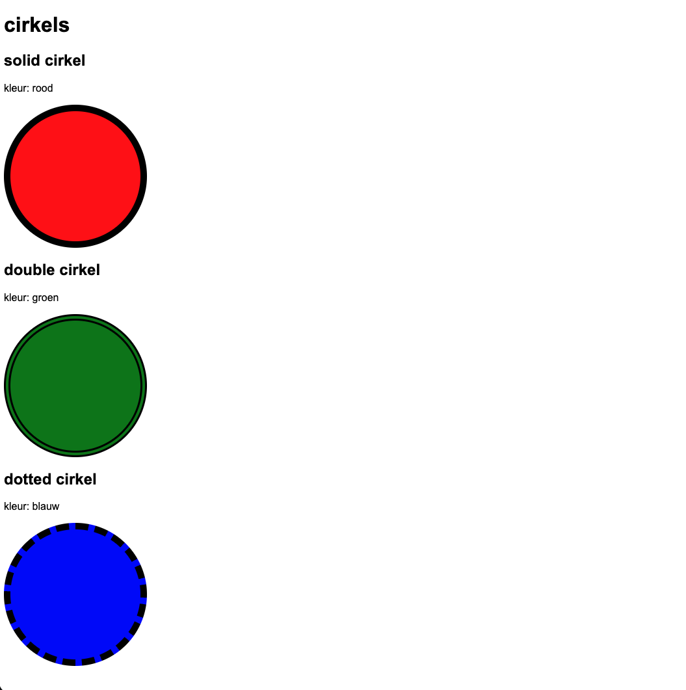

**body**
* lettertype Arial, Helvetica, sans-serif met een grootte van 1rem
* de tekst wordt gecentreerd
* titels worden in het vet gezet

**alle cirkels**
* alle cirkels hebben een hoogte en breedte van 200px
* alle cirkels hebben een border radius van 50%
* alle cirkels hebben een zwarte rand van 10px
* alle cirkels hebben hun marge op automatisch staan (margin: auto)

**rode cirkel**
* achtergrondkleur is rood 
* rand is doorlopend (solid)

**groene cirkel**
* achtergrondkleur is groen 
* rand is dubbel (double)

**blauwe cirkel**
* achtergrondkleur is blauw 
* rand is gestippeld (dashed)
## Verwacht resultaat

