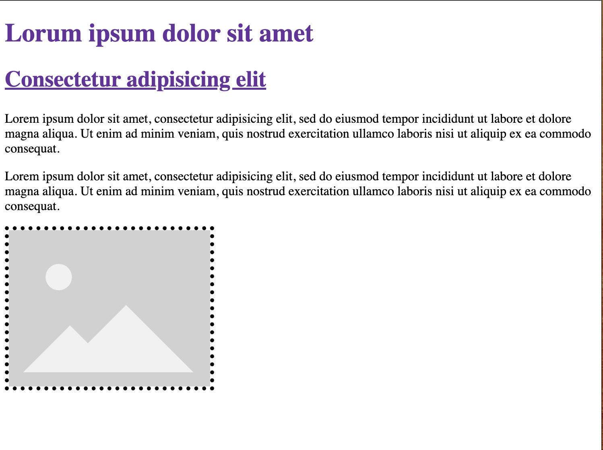

# color-size-border

* plaats een titel, ondertitel, 2 paragrafen en een afbeelding (reeds voorzien)
* vul de stylesheet in en link hem aan de pagina
  * maak de titel 32px groot
  * maak de ondertitel 28px groot
  * zet beide titels in de kleur "rebeccapurple" en het vet
  * onderlijn enkel de ondertitel
  * zet de paragrafen op 16px
  * geef de afbeelding een gestipte zwarte rand van 5px dik

## Verwacht resultaat

