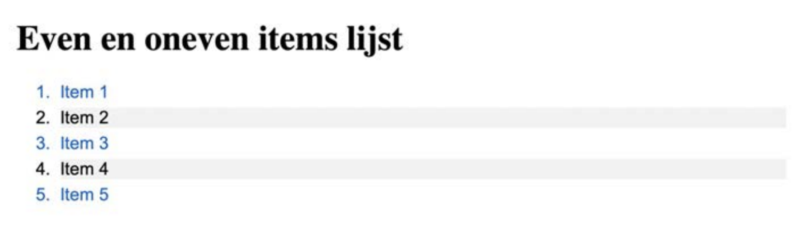

Maak het afbeeldingsbestand in bijlage na. Gebruik de juiste HTML-elementen en volg de eerder gemaakte afspraken.

Hier moet je een genummerde lijst gebruiken. De bullets zouden automatisch genummerd moeten zijn, de tekst van de lijstitems (bijvoorbeeld "Item 1") mag je wel zelf invullen.

Gebruik de `:even` en `:odd` pseudoklassen om verschillende stijlen toe te passen op even en oneven genummerde items in de lijst.

## Verwacht resultaat

