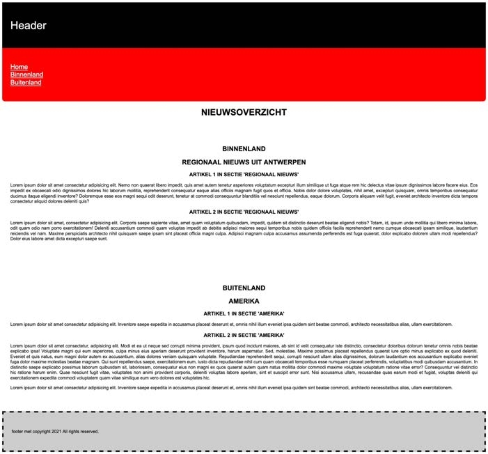

**body**
  *  lettertype Arial, Helvetica, sans-serif met een grootte van 1rem
  *  lijn de tekst uit, zowel links als rechts
  *  titels worden gecentreerd en in hoofdletters gezet header
  *  zwarte achtergrondkleur en een witte tekstkleur
  *  grootte lettertype van 2.5rem
  *  padding zowel boven als onder van 60px

**header**
  * zwarte achtergrondkleur en een witte tekstkleur
  * grootte lettertype van 2.5rem
  * padding zowel boven als onder van 60px

**nav**
  * rode achtergrondkleur
  * font grootte van 1.5rem
  * padding zowel boven als onder van 30px
  * border radius op de onderste hoeken van 10px
  * geef links een witte kleur

**section**
  * padding zowel boven als onder van 60px
  * padding zowel links als rechts van 30px

**footer**
  * achtergrondkleur #ccc
  * font-grootte van 1rem
  * padding zowel boven als onder van 60px
  * padding zowel links als rechts van 30px
  * zwarte rand van 5px met korte lijntjes (dashed)
## Verwacht resultaat

