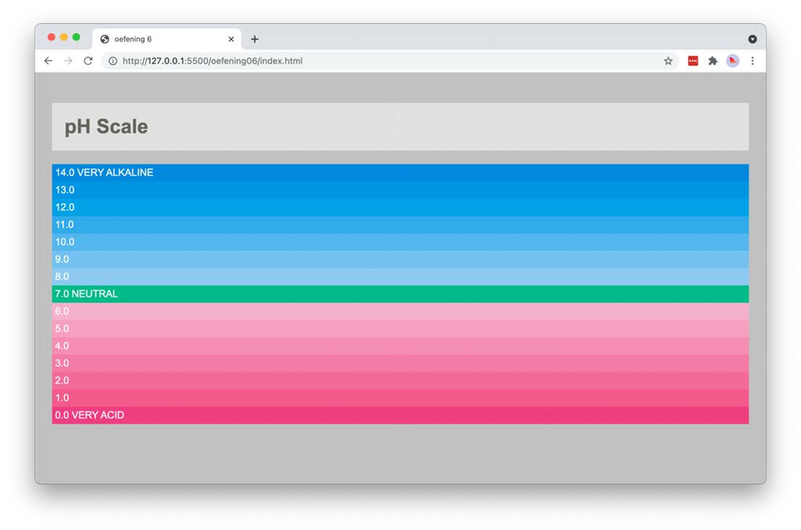

# ph-scale-box

Kopieer je oplossing van `ph-scale` uit labo 3 en werk die verder uit met het box model.

* Pas de volgende styling toe:
  * de body krijgt 20px padding rondom
  * de titel (`h1`) krijgt dezelfde padding als de body, dus ook 20px rondom
  * elke paragraaf krijgt 5px padding
  * de standaardmarge tussen de paragrafen verdwijnt, zodat de kleurbalken naadloos op elkaar aansluiten

## Verwacht resultaat

