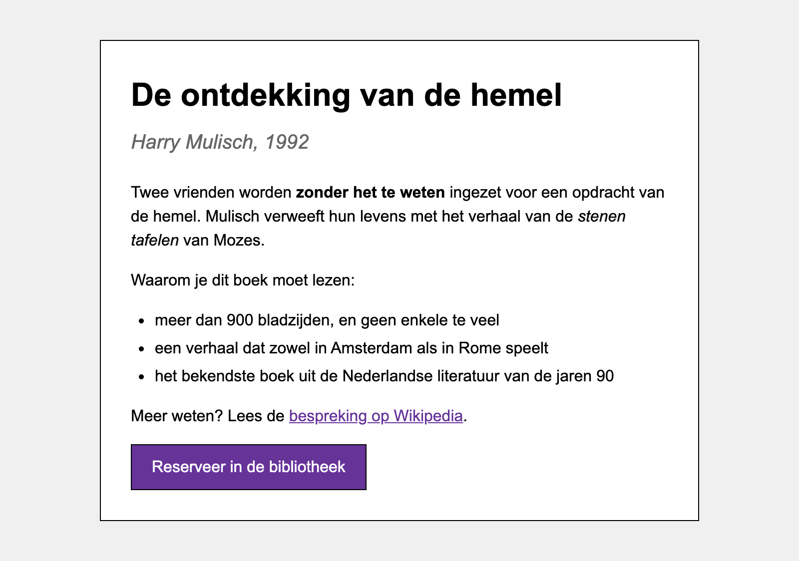

# reset-vs-normalize

In deze oefening bouw je **twee keer exact dezelfde pagina**. De eerste keer vertrek je van een
`reset.css`, de tweede keer van een `normalize.css`. De HTML blijft identiek, enkel je eigen
stylesheet verschilt.

Lees eerst de theorie over [reset vs normalize](https://webtechnologie.apload.be/css/box-model/reset).

De twee stylesheets staan al klaar:

```
reset-vs-normalize/
├─ met-reset/
│  └─ css/
│     └─ reset.css            (The New CSS Reset)
└─ met-normalize/
   └─ css/
      └─ normalize.css        (modern-normalize)
```

## deel 1: met reset.css

Maak in de map `met-reset/` een `index.html` en een `css/style.css`. Koppel in de `head` eerst
`reset.css` en daarna `style.css`.

**HTML**

Neem exact deze structuur over:

```html
<main class="card">
    <h1>De ontdekking van de hemel</h1>
    <h2>Harry Mulisch, 1992</h2>
    <p>Twee vrienden worden <strong>zonder het te weten</strong> ingezet voor een opdracht van de
        hemel. Mulisch verweeft hun levens met het verhaal van de <em>stenen tafelen</em> van Mozes.</p>
    <p>Waarom je dit boek moet lezen:</p>
    <ul>
        <li>meer dan 900 bladzijden, en geen enkele te veel</li>
        <li>een verhaal dat zowel in Amsterdam als in Rome speelt</li>
        <li>het bekendste boek uit de Nederlandse literatuur van de jaren 90</li>
    </ul>
    <p>Meer weten? Lees de <a href="https://nl.wikipedia.org/wiki/De_ontdekking_van_de_hemel">bespreking op Wikipedia</a>.</p>
    <button>Reserveer in de bibliotheek</button>
</main>
```

**CSS**

Schrijf je stylesheet volledig zelf. Je mag niets uit de reset aanpassen. Alles wat de reset
weggegooid heeft en toch in het ontwerp staat, zet je zelf opnieuw.

* `body`
  * lettertype Arial, Helvetica, sans-serif met een grootte van 16px
  * regelhoogte van 1.5
  * zwarte tekstkleur op een achtergrond `#f0f0f0`
  * geen marge rond de pagina
* `.card`
  * breedte van 600px, horizontaal gecentreerd met 40px marge boven en onder
  * padding van 30px rondom
  * witte achtergrond met een zwarte rand van 1px
* `h1`
  * 32px, in het vet
  * 8px marge onder, geen marge boven
* `h2`
  * 20px, **niet** in het vet, wel cursief
  * kleur `#666`
  * 24px marge onder, geen marge boven
* elke `p`
  * 16px marge onder, geen marge boven
* `strong` staat in het vet, `em` staat cursief
* de link is `rebeccapurple` en onderlijnd
* `ul`
  * ronde opsommingstekens (`disc`)
  * 24px inspringing links
  * 16px marge onder, geen marge boven
* elke `li` heeft 4px marge onder
* `button`
  * padding van 10px boven en onder, 20px links en rechts
  * lettertype van 16px, dezelfde regelhoogte als de rest van de pagina (1.5)
  * zwarte rand van 1px
  * achtergrond `rebeccapurple` met witte tekst
  * een handje als muisaanwijzer

## deel 2: met normalize.css

Maak nu in de map `met-normalize/` opnieuw een `index.html` en een `css/style.css`. Koppel deze
keer `normalize.css` vóór je eigen stylesheet.

* Neem **exact dezelfde HTML** over. Pas enkel het pad in de `link` aan.
* Begin met een **leeg** `style.css`. Schrijf niet opnieuw wat je in deel 1 getypt hebt, maar
  bekijk eerst wat de browser je al gratis geeft.
* Voeg nu regel per regel toe tot de pagina er **identiek** uitziet als die van deel 1. Vergelijk
  de twee pagina's naast elkaar in je browser.

> **TIP**: zet beide pagina's open in twee tabbladen en wissel ertussen. Elk verschil dat je ziet,
> is een regel die je nog mist.

## deel 3: vergelijk

Maak in de map `reset-vs-normalize/` een bestand `bevindingen.md` en antwoord daarin kort:

1. Hoeveel declaraties (regels die eindigen op `;`) staan er in elk `style.css`? Verrast het
   resultaat je?
2. Welke declaraties had je **enkel** nodig in de reset-versie? Verklaar per declaratie welke
   browserstijl de reset weggegooid heeft.
3. Welke declaraties had je **enkel** nodig in de normalize-versie? Waarom moest je die in de
   reset-versie niet schrijven?
4. Welke van de twee zou je kiezen voor dit ontwerp? En voor een pagina met enkel lange lappen
   tekst? Motiveer.

## Verwacht resultaat

Beide pagina's zien er na deel 1 en deel 2 hetzelfde uit:


