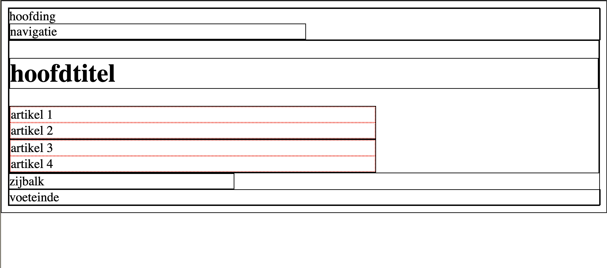

# universal-box

* index.html
  * gebruik de elementen voor een basis HTML5-website (`header`, `nav`, `footer`, `section`, `article` en `aside`)
* vul de stylesheet in
  * plaats een zwarte, dunne kader rond elk element
  * laat de header en footer de volledige breedte innemen
  * de hoofdinhoud (section) neemt 62% in en de zijbalk (aside) 38%
  * de navigatie (nav) is de helft van de header
  * de article-elementen krijgen een gestipte rode kader

## Verwacht resultaat

